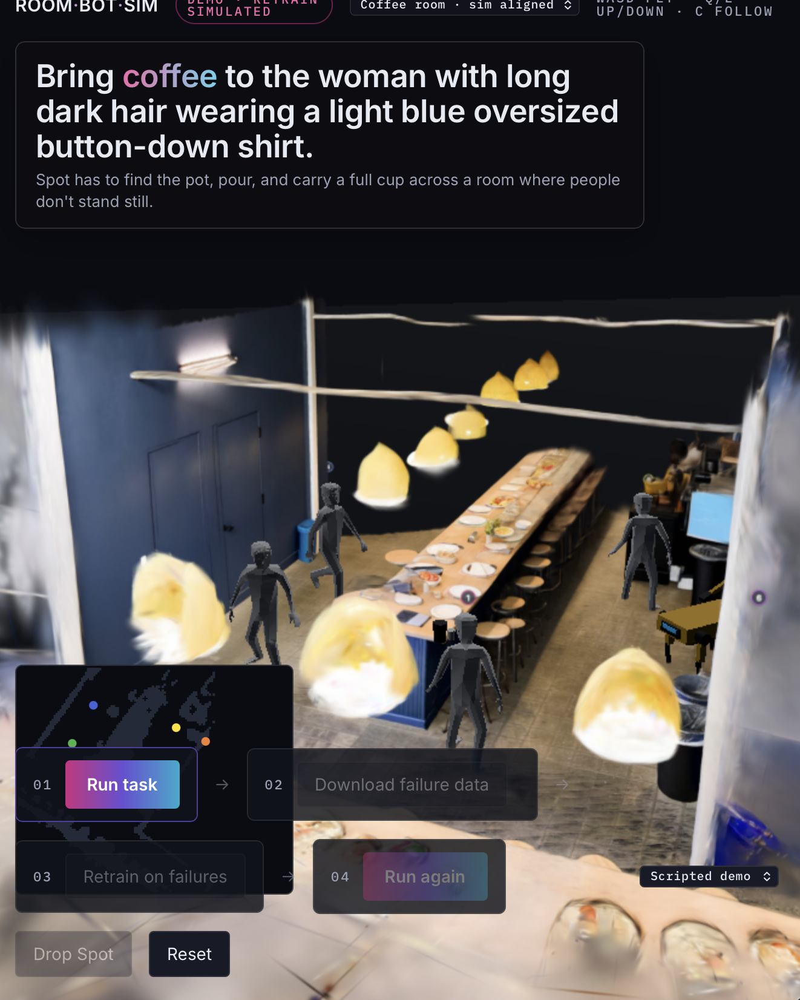

# RoomBotSim



*RoomBotSim: reconstructed room, live crowd, and task-control interface.*

Four chest-height photos of a room become a walkable simulation of that room, with the people who were
in it. You drop a robot in, give it a task in plain language, and every attempt is recorded as robot
training data — including the failures, which are the point.

```
photos ──► World Labs Marble ──► cross-compare & repair ──► occupancy grid ──► MuJoCo
   │                                                                             │
   └──────► qwen3.7-flash: who is here, what is furniture ──────────────────────►┘
                                                                                 │
                          your model ◄── observation JSON ── skill runner ◄──────┘
                                    └──► action JSON ──► executed, recorded, scored
```

## Run it

```bash
cd roombotsim
uv venv .venv --python 3.13 && uv pip install -r requirements.txt --python .venv/bin/python
cp .env.example .env          # then paste your keys in
set -a; . ./.env; set +a
.venv/bin/python -m uvicorn server:app --host 0.0.0.0 --port 8000
```

Open `http://<your-ip>:8000`. Click **Load demo room** to get a running room with no photos and no API
calls, or upload four photos and click **Build room**.

Tests, all offline:

```bash
.venv/bin/python tests/run_all.py     # 14 checks, no network
```

## Keys

| Variable | What it is |
|---|---|
| `WORLDLABS_API_KEY` | World Labs Marble (the World API). Reconstruction. |
| `OPENROUTER_API_KEY` | The vision and chat model. `VLM_MODEL` defaults to `qwen/qwen3.7-flash`. |

`WORLD_SOURCE` picks the reconstructor: `marble` (default), `local` (pre-computed artifacts you drop in),
`mock` (the synthetic demo room), `fallback` (skip reconstruction, let the vision model estimate the layout).

## Driving the robot from your own model

Two directions, both live.

**The server calls your model.** Start an episode with a policy pointing at any OpenAI-compatible
endpoint. Nothing else changes.

```bash
curl -X POST localhost:8000/episode/start/test -H 'Content-Type: application/json' -d '{
  "task_type":"coffee_to_person","task_text":"go find the coffee and bring it to me",
  "requester":2,"robot_type":"spot","seed":5,
  "policy":{"kind":"chat","url":"https://api.deepseek.com/v1/chat/completions",
            "model":"deepseek-chat","key":"sk-..."}}'
```

**Your model calls the server.** Start a task, read the observation, post one action at a time. Each
action blocks until the skill finishes and returns the result plus the next observation.

```bash
curl -X POST localhost:8000/api/task/test    -d '{"task":"go find the coffee and bring it to me"}'
curl      localhost:8000/api/observe/test
curl -X POST localhost:8000/api/act/test     -d '{"action":"navigate_to","target":"pot"}'
curl -X POST localhost:8000/api/act/test     -d '{"action":"pick","object":"pot"}'
```

`GET /api/schema` returns the action schema and the system prompt to hand your model.

## Skills

`navigate_to(target)` · `pick(object)` · `place(object, target)` · `pour(cup)` · `say(text)` · `done`

Each has real preconditions. Picking from 1.3 m away fails with `too_far`; pouring 20 cm off-axis
spills. Failures are tagged, not smoothed over.

## The data loop

1. Run episodes with your model. The panel shows SUCCESS or FAIL with tags per run.
2. **Build training set** relabels every failed step with what the scripted oracle would have done from
   that exact state, and writes chat-format JSONL.
3. Fine-tune on it, point `policy.url` at the result.
4. **Rerun with current policy** replays the same room, seed, task and crowd schedule so the two runs
   are comparable side by side.

## Repository layout

```
roombotsim/       runnable FastAPI app, simulation, frontend, tests and tools
docs/specs/       implementation specifications and task briefs
docs/operations/  runbooks and performance notes
docs/audit/       historical acceptance reports
```

## Application layout

| File | What it does |
|---|---|
| `marble.py` | World Labs Marble client: upload, multi-image generate, poll, export PLY/GLB |
| `fusion.py` | Cross-compares several reconstructions and repairs the geometry |
| `recon.py` | Reconstruction adapters and the common `Recon` contract |
| `geometry.py` | Floor alignment, occupancy grid, obstacle boxes, landmarks |
| `perception.py` | Vision-model prompts: people, landmark labels, layout fallback |
| `planning.py` | A*, inflation, line-of-sight simplify, pure pursuit, social force |
| `sim.py` | MJCF builder (Spot and humanoid rigs) and the MuJoCo wrapper |
| `agents.py` | The cast: sampler, LLM brain, 20 Hz crowd controller |
| `skills.py` | Skill runner with preconditions and outcomes |
| `policy.py` | Policy kinds and the scripted oracle |
| `episodes.py` | Episode lifecycle, evaluators, failure tags, JSONL recorder |
| `server.py` | Pipeline, runtime loop, WebSocket, HTTP API |
| `static/index.html` | The whole operator console |

Current implementation specifications are in `docs/specs/`.
